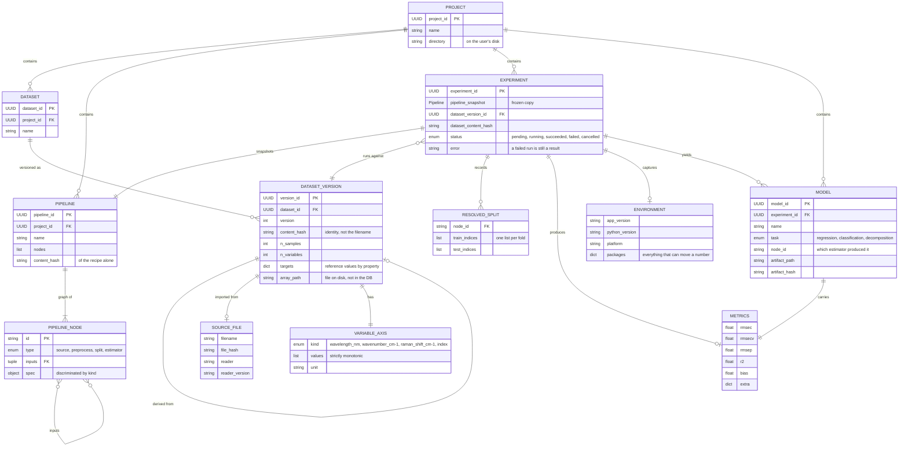
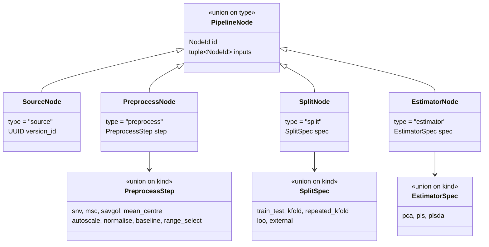
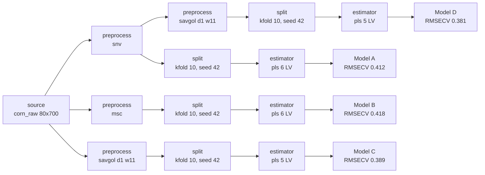

# Data model

Pydantic models live in [`../src/chemometrics_workbench/models.py`](../src/chemometrics_workbench/models.py). Their invariants are exercised by `tests/test_models.py` — run `uv run pytest`.

These models are the schema for the reproducibility guarantee in `PROPOSAL.md` §8. Three decisions carry most of the weight:

**An Experiment stores a snapshot of its pipeline, not a reference.** Pipelines are edited constantly. Holding a reference would mean that editing a pipeline silently rewrites the provenance of every experiment that ever used it. `Pipeline` is frozen, so "editing" produces a new object and every prior snapshot stays intact.

**A split's recipe and its result are stored separately.** `SplitSpec` holds strategy and seed — part of the recipe, reusable. `ResolvedSplit` holds the index sets the run actually produced, and lives on the Experiment. Storing the indices is what lets a split survive a change in scikit-learn's fold assignment.

**Node parameters are discriminated unions, not dicts.** An invalid pipeline fails at parse time rather than eleven minutes into a cross-validation. `SavitzkyGolay` refuses an even window; `Pipeline` refuses a cycle or a dangling input.

## Entities

## Node and parameter types

Every node carries a typed spec, resolved by a discriminator field. This is what makes a pipeline safe to round-trip through JSON.

## A pipeline in practice

The branch-comparison case from the design brief, as it exists in the model — one `Pipeline` whose nodes fork from a single source:

Because `Pipeline.content_hash()` covers the nodes and nothing else — not ids, not timestamps — two pipelines that would compute the same thing hash identically, and one changed parameter changes the hash. That is what makes *"these two models differ only in preprocessing"* a query rather than a feature to be built.

## Where they are stored

Phase 1.3 put the index in SQLite, one database per project directory at `project.db`
(`src/chemometrics_workbench/db.py`). The rule from `PROPOSAL.md` §11 decides what goes where:
**the database holds references, files hold contents.**

| Table | Holds | Queried by |
| --- | --- | --- |
| `project` | the `Project` record | opening a directory |
| `dataset`, `dataset_version` | what has been imported | the dataset list, and finding the newest version |
| `pipeline` | the recipe, with its `content_hash` as a column | reading the pipeline; "which pipelines compute the same thing" |
| `pipeline_layout` | canvas coordinates | drawing the canvas |
| `experiment` | the provenance record | the last experiment |
| `cache_entry` | a node's cache key against the arrays it produced | the executor, before it recomputes |

Every row carries the Pydantic model's own JSON in a `document` column, with only the columns a
query actually filters or orders on beside it. `models.py` is the schema of record; mirroring twenty
classes into columns would make two of them, which is
`docs/decisions/0002-phase-1-shape.md`'s decision, not this file's.

**Not in the database:** `arrays/<sha256>.npy` and `results/<key>.json` — those are contents. Nor
the registry of directories the user has opened, which lives in their config directory because it is
the one thing a project directory cannot know.

**Layout is a table of its own**, not a column on `pipeline`, for the reason stated below: writing a
position must touch a different row than the recipe, so moving a node cannot change a content hash
or invalidate a cache entry.

## Not yet modelled

Deliberate gaps, to be filled when the work reaches them:

- **Model artifact contents** — the fitted parameters themselves, and the JSON and Python-snippet export formats (`PROPOSAL.md` §9). Currently a path plus a hash.
- **Job and progress state** for long-running executions. The Experiment records the outcome; the job queue that produces it is a separate concern.
- **Report** entities.
- **Prediction runs** against a saved model.
- **Node layout** (canvas coordinates) is modelled only as presentation state, deliberately kept out of the scientific record: its own `pipeline_layout` table, alongside the pipeline rather than inside its hash.
